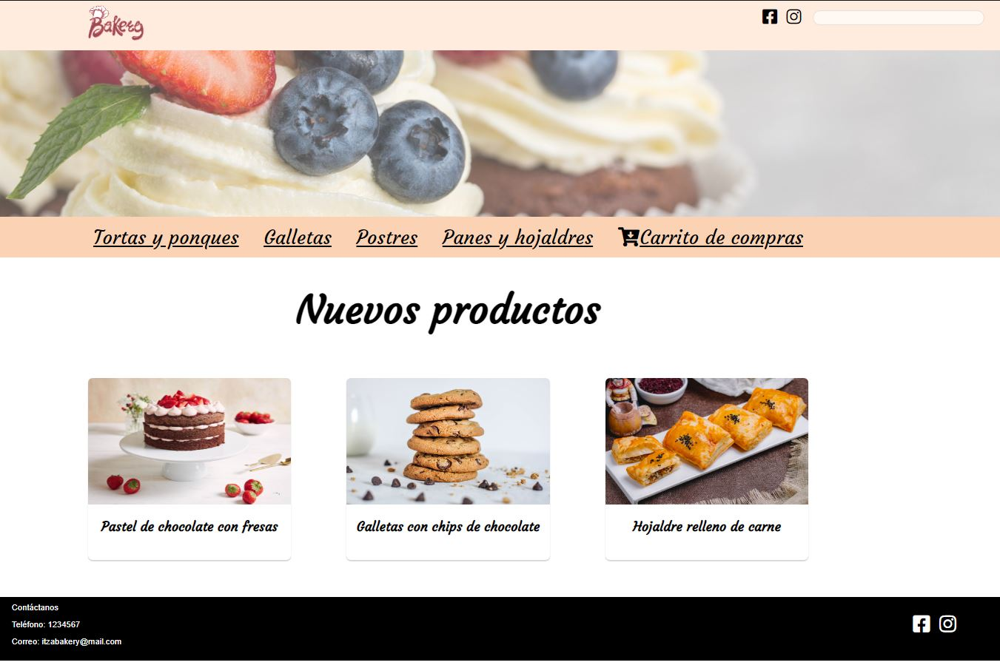
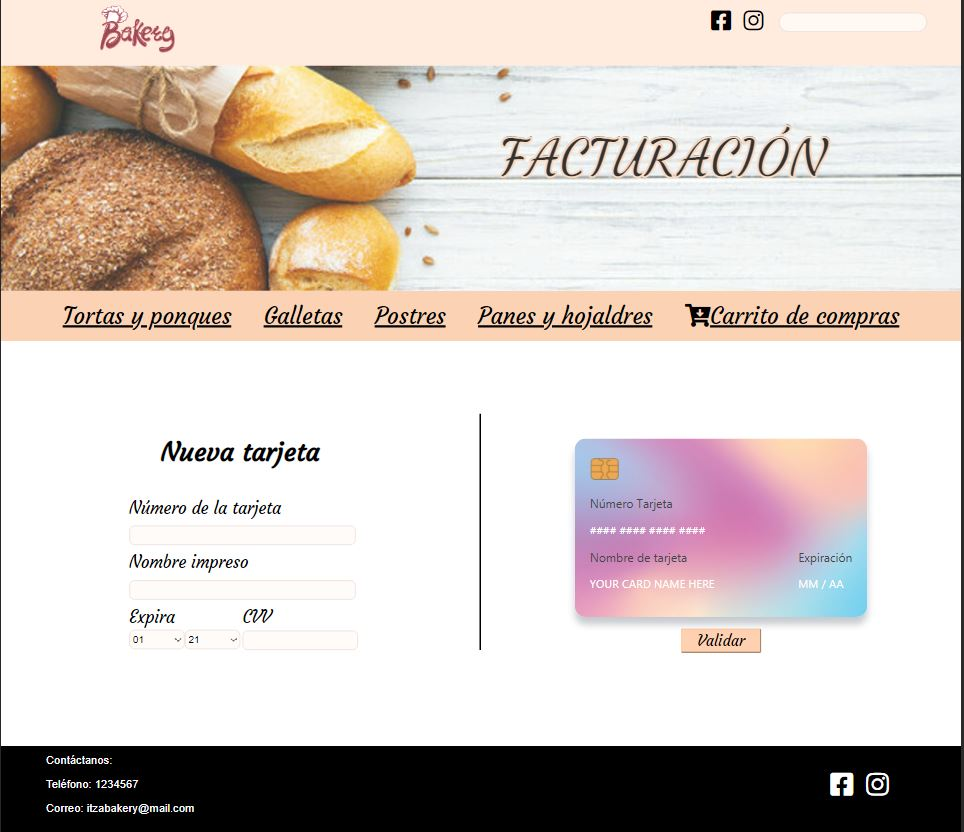
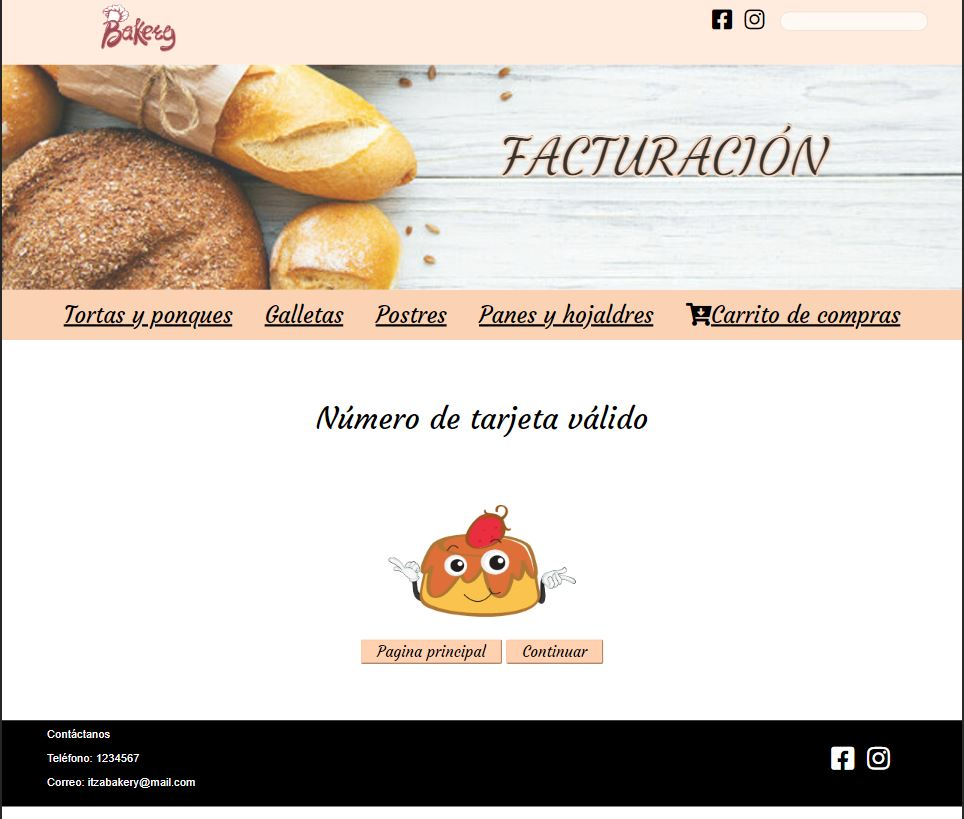
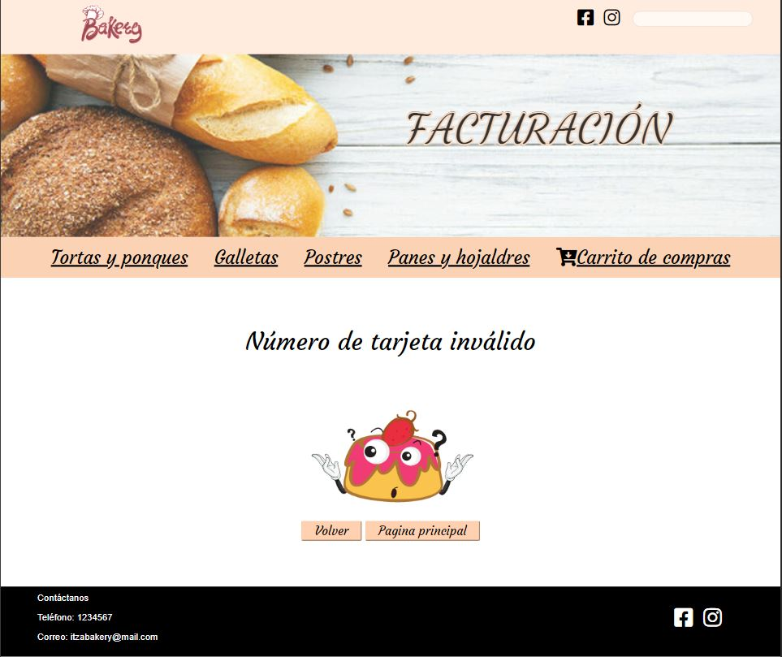
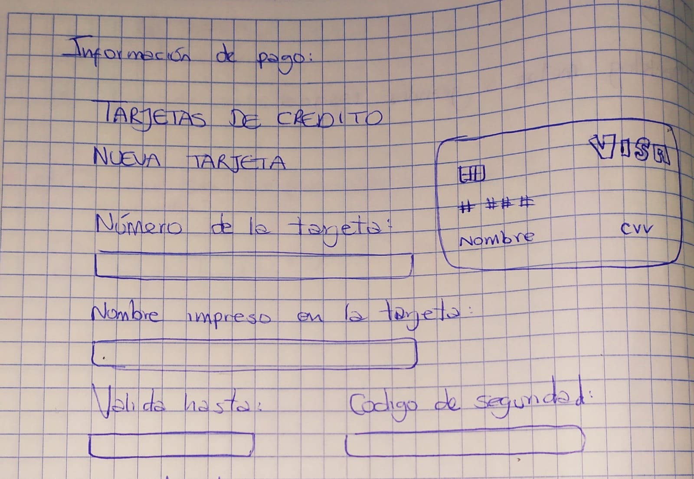
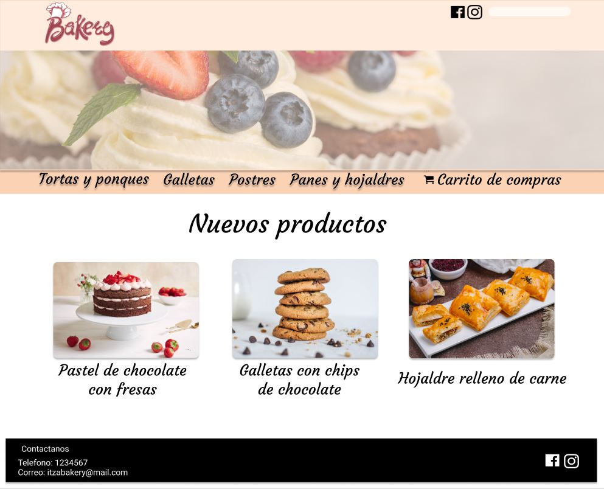
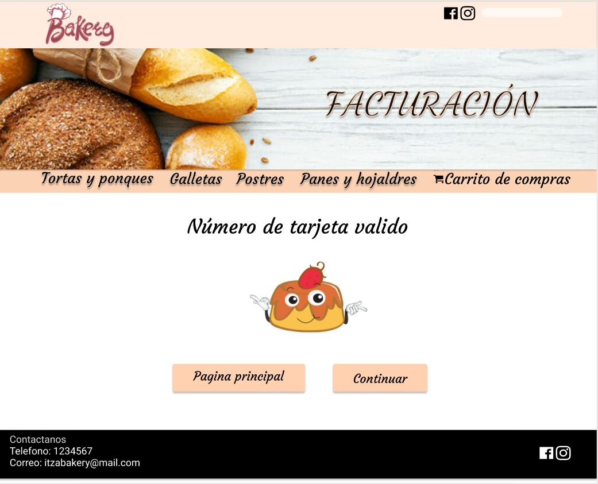
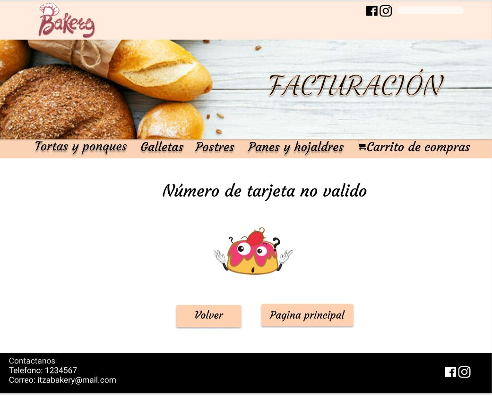
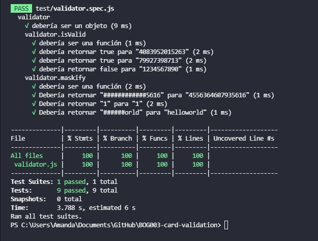

#  Validación de tarjeta de crédito

Este proyecto busca validar las tarjetas de crédito  de los clientes de la pastelería "Bakery" cuando quieran hacer sus comprar por medio de este pago electrónico, solo con insertar el número de su tarjeta y dar click en validad se podra verificar si es valida o no para continuar con la compra por medio del algoritmo de Luhn. 

## Interfaz de usuario

Para la interfaz se buscó la utilización de una paleta de colores agradable a la vista, además de una fácil navegación.
La realización del prototipo final se utilizó la herramienta Figma:

## Imagen Final del proyecto

## Definición el producto
Bakery es una pastelería donde realizan y venden pasteles y productos de panadería de alta calidad donde se quiere implementar el pago por medio de tarjeta de crédito.

### Investigación UX:
* ¿Quiénes son los principales usuarios de producto?

Los principales usuarios son todos aquellos que esten interesados en la compra de productos de panaderia y reposteria por medio de tarjeta de crédito Mastercard o Visa

* ¿Cuáles son los objetivos de estos usuarios en relación con tu producto?
- Compra segura por medio de pago electrónico
- Cuidado de la privacidad al ocultar los números de la tarjeta de crédito a excepción de sus últimos cuatro dígitos 

* ¿Qué problema soluciona?
El validador esta encargado de mostrar la transparencia y seguridad que se tienen en las transacciones por medio de pagos con tarjeta de crédito a la pasteleria como a sus clientes.

## Primer prototipo

 

## Feedback
Se sugirio el uso de fuentes fácilmente legibles y una página principal que llevara seguidamente a la de validación.

## Prototipo Final

## Testing
Se realizo testing unitario del proyecto para verificar tu total funcionalidad

